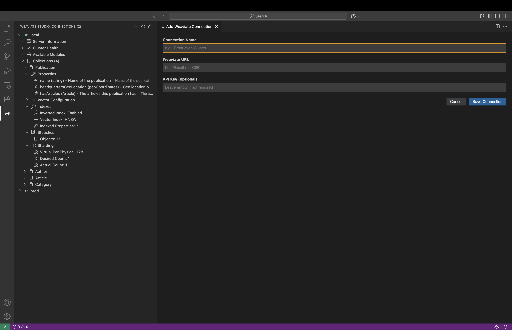

# Weaviate Studio

<div align="center">


**A powerful VS Code extension for managing Weaviate vector databases with an intuitive GraphQL interface**

[](https://marketplace.visualstudio.com/items?itemName=weaviate.weaviate-studio)
[](https://opensource.org/licenses/MIT)
[](https://www.typescriptlang.org/)
[](https://reactjs.org/)

</div>

## Features

### Connection Management
- Connect to multiple Weaviate instances simultaneously
- Secure credential storage with VS Code's built-in secret storage
- Support for both local and cloud-hosted Weaviate deployments
- Connection health monitoring and automatic reconnection

### Advanced Data Visualization
- **Table View**: Intelligent flattening of nested JSON data into readable tables
- **JSON View**: Syntax-highlighted, collapsible JSON viewer
- **Schema Explorer**: Interactive browsing of your Weaviate schema
- **Real-time Results**: Live query execution with instant feedback

### Intelligent GraphQL Editor
- **Syntax Highlighting**: Full GraphQL syntax support with Monaco Editor
- **Auto-completion**: Context-aware suggestions based on your schema
- **Schema-Aware Queries**: Automatic generation of sample queries with proper reference handling and geo-coordinate support
- **Error Detection**: Real-time validation and error highlighting
- **Enhanced Query Templates**: 9 comprehensive templates covering all major Weaviate operations
- **Reference Field Support**: Intelligent detection and proper sub-selection generation for cross-references
- **Type-Safe Generation**: Handles all Weaviate data types including geoCoordinates, vectors, and primitives
- **Query Templates**: Pre-built templates for common operations

### Schema Management
- Browse collections and their properties
- View detailed schema information including data types and relationships
- Support for cross-references and nested object structures
- Visual representation of your data model

### Enhanced Tree View
The Weaviate Explorer now provides comprehensive information at both connection and collection levels:

#### **Connection-Level Information**
- **Server Information**: Weaviate version, git hash, hostname
- **Cluster Health**: Connection status, collection count, health indicators  
- **Available Modules**: Installed modules with versions (text2vec-openai, generative-openai, etc.)
- **Collections Overview**: Organized collection grouping with counts

#### **Collection-Level Information**
- **Properties**: View all collection properties with their data types and descriptions
- **Vector Configuration**: 
  - Vectorizer settings (text2vec-openai, text2vec-transformers, etc.)
  - Module configurations 
  - Vector index type (HNSW, Flat, etc.)
- **Indexes**: 
  - Inverted index status
  - Vector index configuration
  - Count of indexed properties
- **Statistics**: 
  - Live object count
  - Tenant count (for multi-tenant collections)
- **Sharding & Replication**:
  - Sharding configuration (virtual per physical, desired/actual shard count)
  - Replication factor
  - Multi-tenancy status

### 🔍 Schema Analysis

#### **Enhanced Schema Viewer**
Right-click on any collection → **"View Detailed Schema"**
- **📋 Overview Tab**: Quick stats, vector config, module settings
- **🔧 Properties Tab**: Detailed property information with types and indexing
- **📄 Raw JSON Tab**: Complete schema definition with copy functionality
- **🚀 API Equivalent Tab**: Ready-to-use code in Python, JavaScript, and cURL
- **🐍 Creation Scripts Tab**: Complete Python scripts and property details for recreation

*One comprehensive viewer for all your schema analysis needs - from quick overview to complete recreation scripts!*

### Developer Experience
- **Hot Reload**: Instant updates during development
- **TypeScript Support**: Full type safety and IntelliSense
- **Modern UI**: Dark theme optimized for VS Code
- **Responsive Design**: Works seamlessly across different screen sizes

## Screenshots

### Connection Management


### GraphQL Query Interface


### Table View Results


### Schema Explorer


## Quick Start

### Installation

1. **From VS Code Marketplace** (Recommended)
   - Open VS Code
   - Go to Extensions (Ctrl+Shift+X)
   - Search for "Weaviate Studio"
   - Click Install

2. **From VSIX Package**
   ```bash
   code --install-extension weaviate-studio-0.0.1.vsix
   ```

### First Steps

1. **Open Weaviate Studio**
   - Click the Weaviate icon in the Activity Bar
   - Or use Command Palette: `Ctrl+Shift+P` → "Weaviate: Open Query Editor"

2. **Add Your First Connection**
   - Click "Add New Weaviate Connection"
   - Enter your Weaviate instance details:
     - **Name**: A friendly name for your connection
     - **URL**: Your Weaviate endpoint (e.g., `http://localhost:8080`)
     - **API Key**: (Optional) Your Weaviate API key

3. **Start Querying**
   - Connect to your instance
   - Browse collections in the sidebar
   - Click "Query Collection" to open the GraphQL editor
   - Use the "Sample" button to generate example queries

## Usage Guide

### Managing Connections

```typescript
// Example connection configuration
{
  "name": "Local Development",
  "url": "http://localhost:8080",
  "apiKey": "optional-api-key"
}
```

### Writing GraphQL Queries

The extension provides intelligent auto-completion and validation:

```graphql
{
  Get {
    Article(limit: 10) {
      title
      content
      author {
        ... on Person {
          name
          email
          _additional {
            id
          }
        }
      }
      _additional {
        id
        distance
      }
    }
  }
}
```

### Query Templates

Built-in templates for comprehensive Weaviate operations:

#### **Core Query Templates**
- **Basic Get Query**: Simple data retrieval with metadata and timestamps
- **Vector Search (nearVector)**: Similarity search using vectors with certainty thresholds
- **Semantic Search (nearText)**: Text-based search with move operations and concept refinement
- **Hybrid Search**: Combined BM25 + Vector search with configurable balance and custom vectors

#### **Advanced Query Templates**
- **Filter Query**: Complex filtering with multiple operators (Equal, GreaterThan, Like, etc.)
- **Aggregation Query**: Comprehensive statistics by property type (text, numeric, date, boolean)
- **Relationship Query**: Explore object cross-references and nested relationships
- **Sort Query**: Multi-level sorting with primary and secondary criteria
- **Explore Query**: Object metadata, vectors, and AI-generated content summaries

#### **Template Features**
- **Schema-Aware**: Automatically detects and handles reference fields with proper sub-selections
- **Type-Safe**: Proper handling of all Weaviate data types including `geoCoordinates`
- **Educational**: Comprehensive examples and parameter documentation
- **Error Prevention**: Syntactically correct templates reduce query errors
- **Customizable**: Easy modification for specific use cases

Each template includes:
- Detailed parameter explanations
- Multiple usage examples
- Best practice recommendations
- Error handling guidance

## Development

### Prerequisites

- **Node.js** (v16 or later)
- **npm** (v8 or later)
- **VS Code** (v1.85.0 or later)

### Setup

```bash
# Clone the repository
git clone https://github.com/weaviate/weaviate-studio.git
cd weaviate-studio

# Install dependencies
npm install

# Start development mode
npm run dev
```