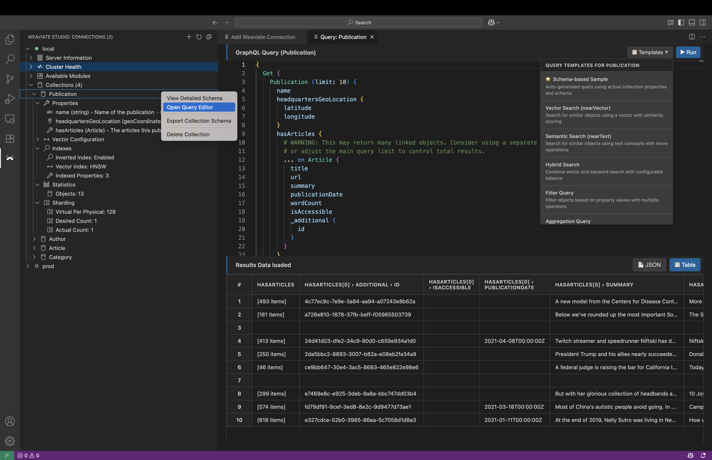
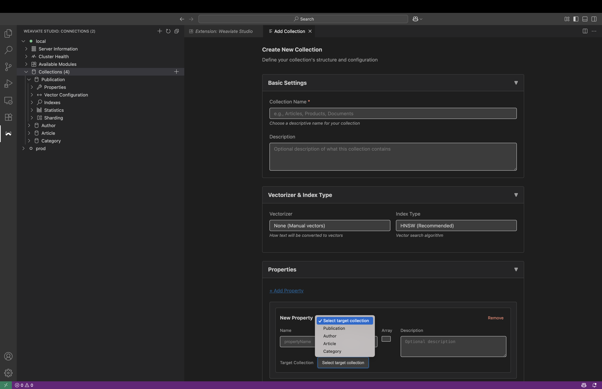

# Weaviate Studio

<div align="center">


**A powerful VS Code extension for managing Weaviate vector databases with an intuitive GraphQL interface**

[](https://marketplace.visualstudio.com/items?itemName=prasadmuley.weaviate-studio)
[](https://open-vsx.org/extension/prasadmuley/weaviate-studio)
[](https://opensource.org/licenses/MIT)
[](https://www.typescriptlang.org/)
[](https://reactjs.org/)

### 🚀 **Available On Multiple Platforms**
| **VS Code** | **Cursor** | **Windsurf** | **Manual Install** |
|-------------|------------|--------------|-------------------|
| [Install from Marketplace](https://marketplace.visualstudio.com/items?itemName=prasadmuley.weaviate-studio) | [Install from Open VSX](https://open-vsx.org/extension/prasadmuley/weaviate-studio) | [Install from Open VSX](https://open-vsx.org/extension/prasadmuley/weaviate-studio) | [Download VSIX](https://github.com/prasadmuley/weaviate-studio/releases) |

</div>

Weaviate Studio is a Visual Studio Code extension that brings a graphical interface for managing and querying Weaviate vector databases—directly inside your code editor. It’s designed to fill the UI gap for self-hosted users, while also providing cloud users with a convenient, integrated experience.

## Why Use Weaviate Studio?
- No Official UI: Self-hosted Weaviate lacks a robust, built-in graphical UI for data exploration and management.
- All-in-One Tool: Manage, query, and monitor your Weaviate instance from within VSCode—no need to switch between browser tabs or use only APIs.
- Supports Both Self-Hosted and Cloud: Connect to any Weaviate instance, whether running locally, on-premises, or in the cloud.

## Screenshots

### GraphQL Query Interface


### Connection Management


### Add Collection


### Detailed Schema


## Features

### Connection Management
- Connect to multiple Weaviate instances simultaneously
- Secure credential storage with VS Code's built-in secret storage
- Support for both local and cloud-hosted Weaviate deployments
- Connection health monitoring and automatic reconnection

### Advanced Data Visualization
- **Table View**: Intelligent flattening of nested JSON data into readable tables
- **JSON View**: Syntax-highlighted, collapsible JSON viewer
- **Schema Explorer**: Interactive browsing of your Weaviate schema
- **Real-time Results**: Live query execution with instant feedback

### Intelligent GraphQL Editor
- **Syntax Highlighting**: Full GraphQL syntax support with Monaco Editor
- **Auto-completion**: Context-aware suggestions based on your schema
- **Schema-Aware Queries**: Automatic generation of sample queries with proper reference handling and geo-coordinate support
- **Error Detection**: Real-time validation and error highlighting
- **Enhanced Query Templates**: 9 comprehensive templates covering all major Weaviate operations
- **Reference Field Support**: Intelligent detection and proper sub-selection generation for cross-references
- **Type-Safe Generation**: Handles all Weaviate data types including geoCoordinates, vectors, and primitives

### Schema Management
- Browse collections and their properties
- View detailed schema information including data types and relationships
- Support for cross-references and nested object structures
- Visual representation of your data model

### Enhanced Tree View
The Weaviate Explorer provides comprehensive information at both connection and collection levels:

#### **Connection-Level Information**
- **Server Information**: Weaviate version, git hash, hostname
- **Cluster Health**: Connection status, collection count, health indicators  
- **Available Modules**: Installed modules with versions (text2vec-openai, generative-openai, etc.)
- **Collections Overview**: Organized collection grouping with counts

#### **Collection-Level Information**
- **Properties**: View all collection properties with their data types and descriptions
- **Vector Configuration**: 
  - Vectorizer settings (text2vec-openai, text2vec-transformers, etc.)
  - Module configurations 
  - Vector index type (HNSW, Flat, etc.)
- **Indexes**: 
  - Inverted index status
  - Vector index configuration
  - Count of indexed properties
- **Statistics**: 
  - Live object count
  - Tenant count (for multi-tenant collections)
- **Sharding & Replication**:
  - Sharding configuration (virtual per physical, desired/actual shard count)
  - Replication factor
  - Multi-tenancy status

## 🔍 Schema Analysis

#### **Enhanced Schema Viewer**
Right-click on any collection → **"View Detailed Schema"**
- **📋 Overview Tab**: Quick stats, vector config, module settings
- **🔧 Properties Tab**: Detailed property information with types and indexing
- **📄 Raw JSON Tab**: Complete schema definition with copy functionality
- **🚀 API Equivalent Tab**: Ready-to-use code in Python, JavaScript, and cURL
- **🐍 Creation Scripts Tab**: Complete Python scripts and property details for recreation

*One comprehensive viewer for all your schema analysis needs - from quick overview to complete recreation scripts!*

### Developer Experience
- **Hot Reload**: Instant updates during development
- **TypeScript Support**: Full type safety and IntelliSense
- **Modern UI**: Dark theme optimized for VS Code
- **Responsive Design**: Works seamlessly across different screen sizes

### Query Templates

Built-in templates for comprehensive Weaviate operations:

#### **Core Query Templates**
- **Basic Get Query**: Simple data retrieval with metadata and timestamps
- **Vector Search (nearVector)**: Similarity search using vectors with certainty thresholds
- **Semantic Search (nearText)**: Text-based search with move operations and concept refinement
- **Hybrid Search**: Combined BM25 + Vector search with configurable balance and custom vectors

#### **Advanced Query Templates**
- **Filter Query**: Complex filtering with multiple operators (Equal, GreaterThan, Like, etc.)
- **Aggregation Query**: Comprehensive statistics by property type (text, numeric, date, boolean)
- **Relationship Query**: Explore object cross-references and nested relationships
- **Sort Query**: Multi-level sorting with primary and secondary criteria
- **Explore Query**: Object metadata, vectors, and AI-generated content summaries

#### **Template Features**
- **Schema-Aware**: Automatically detects and handles reference fields with proper sub-selections
- **Type-Safe**: Proper handling of all Weaviate data types including `geoCoordinates`
- **Educational**: Comprehensive examples and parameter documentation
- **Error Prevention**: Syntactically correct templates reduce query errors
- **Customizable**: Easy modification for specific use cases

Each template includes:
- Detailed parameter explanations
- Multiple usage examples
- Best practice recommendations
- Error handling guidance

## Development

### Prerequisites

- **Node.js** (v16 or later)
- **npm** (v8 or later)
- **VS Code** (v1.80.0 or later)

### Setup

```bash
# Clone the repository
git clone https://github.com/prasadmuley/weaviate-studio.git
cd weaviate-studio

# Install dependencies
npm install

# Start development mode
npm run dev
```

### Packaging and Local Testing

To create a VSIX package for local testing:

```bash
npx vsce package
```

This will generate a `.vsix` file in your project root.

To install it in VS Code:

```bash
code --install-extension weaviate-studio-1.0.1.vsix
```

You can also use the Extensions sidebar's "Install from VSIX..." option.

### Available Scripts

```bash
# Development
npm run dev                 # Start development with watchers
npm run compile             # Compile TypeScript
npm run watch              # Watch for changes
npm run build:webview      # Build webview in development mode

# Production
npm run package            # Package for production
npm run package:webview    # Package webview for production

# Testing
npm test                   # Run all tests
npm run test:watch         # Run tests in watch mode
npm run test:coverage      # Run tests with coverage report

# Code Quality
npm run lint               # Run ESLint
npm run lint:fix           # Run ESLint with auto-fix
npm run format             # Format code with Prettier
npm run format:check       # Check code formatting
```

### Testing

The project includes comprehensive test coverage using Jest:

#### Test Structure

The project follows Jest best practices with colocated test files:

```
src/
├── WeaviateTreeDataProvider/
│   ├── WeaviateTreeDataProvider.ts
│   └── __tests__/
│       └── WeaviateTreeDataProvider.test.ts
├── services/
│   ├── ConnectionManager.ts
│   └── __tests__/
│       └── ConnectionManager.test.ts
├── query-editor/webview/
│   ├── graphqlTemplates.ts
│   └── __tests__/
│       └── graphqlTemplates.test.ts
├── webview/
│   ├── formatGraphQL.ts
│   └── __tests__/
│       └── formatGraphQLQuery.test.ts
└── test/
    ├── setup.ts
    └── mocks/
        ├── vscode.ts
        ├── monaco-editor.ts
        └── weaviate-client.ts
```

#### Test Coverage

- **ConnectionManager**: Connection validation, management, and error handling
- **GraphQL Templates**: Template generation, schema-aware queries, and type safety
- **WeaviateTreeDataProvider**: Tree view structure, data providers, and UI interactions
- **Utility Functions**: GraphQL formatting and helper methods

All tests use proper mocking for VS Code APIs, Monaco Editor, and Weaviate client dependencies.

#### Quality Assurance

The project maintains high code quality through:

- **Comprehensive Unit Tests**: Complete test coverage for all core functionality
- **Integration Tests**: Service interactions and component behavior
- **Type Safety**: Full TypeScript coverage with strict type checking
- **Code Coverage**: Continuous monitoring of test coverage
- **Linting**: ESLint configuration for code consistency
- **Formatting**: Prettier integration for consistent code style

### Contributing

We welcome contributions! Please see `CONTRIBUTING.md` for guidelines.

#### For Contributors

1. **Fork and clone** the repository
2. **Install dependencies**: `npm install`
3. **Run tests**: `npm test` to ensure everything works
4. **Make changes** with tests for new functionality
5. **Submit a pull request** with a clear description

#### Testing Your Changes

```bash
# Run tests before committing
npm test

# Check code coverage
npm run test:coverage

# Run linting
npm run lint

# Format code
npm run format
```

## License

MIT License - see [LICENSE](LICENSE) file for details.

## Support

- **Issues**: [GitHub Issues](https://github.com/prasadmuley/weaviate-studio/issues)
- **Marketplace**: [VS Code Marketplace](https://marketplace.visualstudio.com/items?itemName=prasadmuley.weaviate-studio)
- **Open VSX**: [Open VSX Registry](https://open-vsx.org/extension/prasadmuley/weaviate-studio)

---

**Happy querying with Weaviate Studio!** 🚀