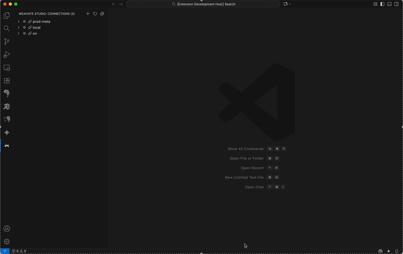

#  Weaviate Studio

---

**A powerful VS Code extension for managing Weaviate vector databases with an intuitive GraphQL
interface. Supports self-hosted and cloud Weaviate instances.**

---

## Key Benefits

- **Unified Experience:** Manage, query, and monitor Weaviate directly in VS Code—no browser switching.
- **Works Everywhere:** Connect to local, on-prem, or cloud Weaviate instances.
- **Visual Data Exploration:** Browse schema, run queries, and view results in rich tables and JSON.
- **Intelligent GraphQL Editor:** Auto-complete (wip), schema-aware templates, and error highlighting.
- **Secure & Productive:** Secure credential storage, hot reload, and type-safe development.

---

## Quick Install

| **VS Code**                                                                                    | **Cursor**                                                             | **Windsurf**                                                           | **Manual Install**                                                       |
| ---------------------------------------------------------------------------------------------- | ---------------------------------------------------------------------- | ---------------------------------------------------------------------- | ------------------------------------------------------------------------ |
| [Marketplace](https://marketplace.visualstudio.com/items?itemName=prasadmuley.weaviate-studio) | [Open VSX](https://open-vsx.org/extension/prasadmuley/weaviate-studio) | [Open VSX](https://open-vsx.org/extension/prasadmuley/weaviate-studio) | [Download VSIX](https://github.com/muleyprasad/weaviate-studio/releases) |

---

## Top Features

- **Multiple Connections:** Manage several Weaviate instances at once
- **Schema Explorer:** Visualize and browse collections, properties, and relationships
- **Advanced Query Editor:** Monaco-powered GraphQL editor with auto-complete and validation
- **Live Results:** Table and JSON views for query results
- **Comprehensive Templates:** Built-in, schema-aware GraphQL templates for all major operations
- **Secure Storage:** Credentials stored with VS Code’s secret storage
- **Modern UI:** Responsive, dark-theme optimized interface

---

## Breaking Changes

- Weaviate client upgrade to `weaviate-client@^3` and move to the Collections API. This requires a Weaviate server that supports the Collections API; legacy class/schema‑only servers are not supported by this version.
- Webview CSP hardened. Scripts are now nonce‑protected; if you previously saw CSP errors, please upgrade.
- Command rename for refresh: `weaviate.refreshConnections` → `weaviate.refresh` (update custom keybindings if any).

---

## Getting Started

1. **Install** Weaviate Studio from the [VS Code Marketplace](https://marketplace.visualstudio.com/items?itemName=prasadmuley.weaviate-studio) or [Open VSX](https://open-vsx.org/extension/prasadmuley/weaviate-studio).
2. **Open the Weaviate Studio panel** from the VS Code sidebar.
3. **Add a connection** to your Weaviate instance (local, on-prem, or cloud).
4. **Explore your schema, run queries, and manage your data—all within VS Code!**

---

<strong>Full Feature List</strong>

### Connection Management

- Connect to multiple Weaviate instances simultaneously
- Secure credential storage with VS Code's built-in secret storage
- Connection health monitoring and automatic reconnection
- Cloud and Custom endpoints with API key support for Cloud
- Advanced options: per-operation timeouts and skip-initialization checks
- API keys are not displayed when editing existing connections
- Optional connect‑on‑expand prompt for disconnected connections

### Data Visualization

- Table view: Flattened, readable tables for nested JSON
- JSON view: Syntax-highlighted, collapsible JSON viewer
- Schema explorer: Interactive browsing of your Weaviate schema
- Real-time results: Live query execution with instant feedback

### GraphQL Editor

- Monaco Editor with full GraphQL syntax support
- Auto-completion and context-aware suggestions
- Schema-aware query generation
- Real-time validation and error highlighting
- Enhanced query templates for all major Weaviate operations
- Reference field support and type-safe generation

### Schema Management

- Browse collections and their properties
- View detailed schema information, data types, and relationships
- Support for cross-references and nested object structures
- Visual representation of your data model
- Create collections via three paths: From scratch, Copy from existing, or Import from JSON schema

### Tree View

- Connection-level: Server info, cluster health, modules, collections overview
- Collection-level: Properties, vectors (with count), inverted index, generative config, statistics, sharding, replication, multi‑tenancy

### Schema Analysis

- Enhanced schema viewer with overview, properties, raw JSON, API equivalents, and creation scripts

### Developer Experience

- Hot reload for instant updates
- Full TypeScript support
- Modern, responsive UI

### Query Templates

- Core: Basic Get, Vector Search, Semantic Search, Hybrid Search
- Advanced: Filter, Aggregation, Relationship, Sort, Explore
- Schema-aware, type-safe, and educational templates

### Bulk Operations

- Delete All Collections (destructive) with double confirmation

---

## Development & Contributing

We welcome contributions! Please see [CONTRIBUTING.md](CONTRIBUTING.md) for setup, development, and pull request guidelines.

Need a quick Weaviate instance for development or learning? Check out our [local sandbox environment](sandbox/readme.md) with pre-configured Docker setup and test data.

---

## Testing & Quality

- Comprehensive unit and integration tests with Jest
- Strict TypeScript and linting for code quality
- See [TESTING_GUIDE.md](TESTING_GUIDE.md) for details

---

## Support & License

- **Issues:** [GitHub Issues](https://github.com/muleyprasad/weaviate-studio/issues)
- **Marketplace:** [VS Code Marketplace](https://marketplace.visualstudio.com/items?itemName=prasadmuley.weaviate-studio)
- **Open VSX:** [Open VSX Registry](https://open-vsx.org/extension/prasadmuley/weaviate-studio)
- **License:** MIT ([LICENSE](LICENSE))

---

**Happy querying with Weaviate Studio! 🚀**
